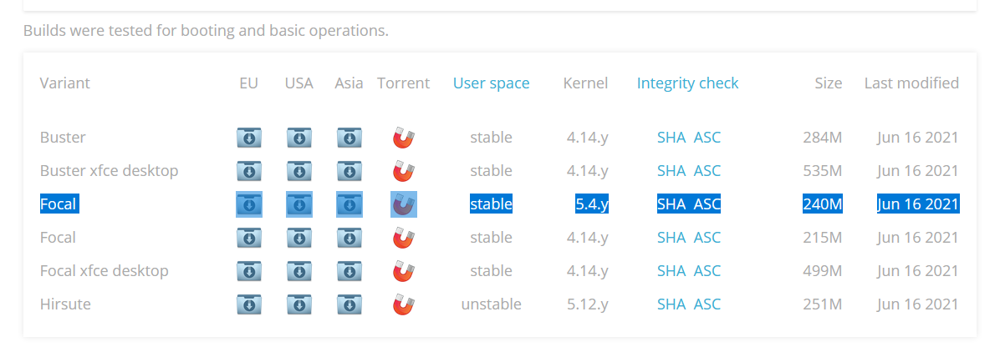

### Docker

You can run docker, but  Upgrade Kernel to 5.x

You can upgrade the kernel to 5.x, run armbian-config

	sudo armbian-config

	* Choose "System"
	* Choose "Other", then "Yes, I understand"
	#* Choose the latest "linux-image-current" kernel
	* Choose Armbian 21.05.6 Focal kernel

## Get and write the OS image

Get an image from the armbian page listed above.

I suggest you get the "current" **Armbian Focal**, which is based on Ubuntu LTS 20.04 and has the 5.x kernel, instead of the default "legacy/stock" version which is based on the 4.x kernel:

[Here is a direct link to download the "current" version](https://redirect.armbian.com/region/EU/odroidxu4/Focal_current)

# Reboot

	sudo reboot
	
	
	
###########################################################################

* SSH login as the new user, in my case 'sv'

	ssh sv@192.168.86.xxx
	
* Add you own public key, in my case

	mkdir $HOME/.ssh
	chmod 700 $HOME/.ssh
	echo 'ssh-ed25519 AAAAC3NzaC1lZDI1NTE5AAAAIEOUWK5GhGu42n434IH2e6wQXrP5SzZLROdSZpEyalB6 s@vilstrup.me' >> $HOME/.ssh/authorized_keys
	chmod -R 600 $HOME/.ssh/*

# add sudo without a password ( https://askubuntu.com/a/878705 )

	echo "$USER ALL=(ALL:ALL) NOPASSWD: ALL" | sudo tee /etc/sudoers.d/$USER

########################################################

Configure unattended-upgrades-on-ubuntu-debian

https://haydenjames.io/how-to-enable-unattended-upgrades-on-ubuntu-debian/

##############################
Install plex

Get deb from: 
https://www.plex.tv/media-server-downloads/#plex-media-server

	wget https://downloads.plex.tv/plex-media-server-new/1.23.5.4862-0f739d462/debian/plexmediaserver_1.23.5.4862-0f739d462_armhf.deb
	
	dpkg -i plex*

####################################

Install jenkins

	sudo apt install openjdk-11-jdk-headless

then follow guide at https://pkg.jenkins.io/debian-stable/

########################################################
PODMAN time

https://podman.io/getting-started/installation

https://build.opensuse.org/package/show/devel:kubic:libcontainers:stable/podman

	. /etc/os-release
	echo "deb https://download.opensuse.org/repositories/devel:/kubic:/libcontainers:/stable/xUbuntu_${VERSION_ID}/ /" | sudo tee /etc/apt/sources.list.d/devel:kubic:libcontainers:stable.list
	curl -L "https://download.opensuse.org/repositories/devel:/kubic:/libcontainers:/stable/xUbuntu_${VERSION_ID}/Release.key" | sudo apt-key add -
	sudo apt-get update
	sudo apt-get -y upgrade
	sudo apt-get -y install podman slirp4netns
	sudo ln -s /run/podman/podman.sock /var/run/docker.sock	##Symlink to cheat compose
	
## Test podman

	podman run --rm hello-world

	alias docker=podman

* Test docker

	docker pull hello-world && time docker run --rm hello-world
	docker pull ubuntu:20.04 && time docker run --rm -it -v "$PWD:/wrk" -w "/wrk" ubuntu:20.04 touch test.txt

* Verify that test.txt is owned by your user, not root.

	ls -lah

	
