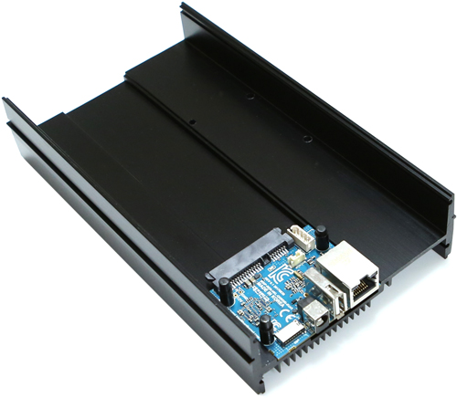

# odroid-hc2

This repo contains notes, scripts and experience for using an [Odroid-HC2 SBC single-board computer, like this one](https://www.hardkernel.com/shop/odroid-hc2-home-cloud-two/).

It's functionally the same board as Odroid-HC1 and Odroid-XU4, so you can use the same images, software and scripts for them all.

It's a very nice arm board that has a built-in SATA connector and giant heatsink/diskmount. With 8 cores (4 big / 4 small) and 2 GB RAM, it's almost as powerful as a Raspberry Pi 4. Single-core CPU performance is worse, but it has more cores, so performance is similar... if the program can take advantage of all 8 cores.

The SATA connector is not native, it actually use the USB controller and USB-to-SATA inside. Performance for the SATA disk is fine, it's equivalent to plugging in a USB3 external drive that supports UASP.

The only drawback is that it uses the armv7l architecture, which is 32-bit and not as well supported as the arm64 architecture (like the Raspberry PI 4 has). That means that software support is a bit more limited and you need to do some trial and error to figure things out. If you enjoy tinkering and learning, this board is great. If you want more compatibility and less headache, get a Raspberry Pi 4.

## Guides

* [Armbian OS install and setup](ARMBIAN.md)
* [Docker, including *rootless* docker](DOCKER.md)
* [Plex, video server](PLEX.md)
* [Jenkins, automation](JENKINS.md)
* [Jellyfin, video server](JELLYFIN.md)
* [Netdata, monitoring](NETDATA.md)
